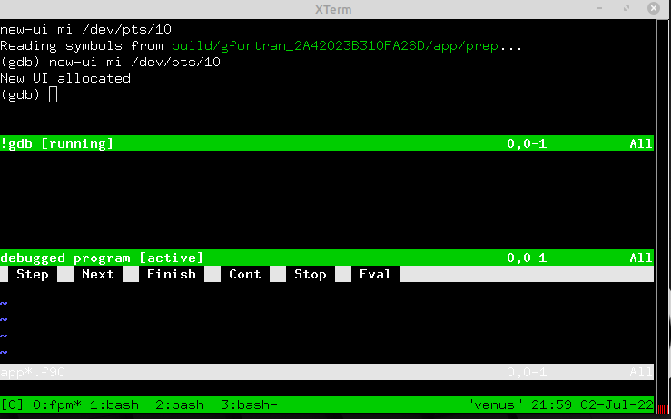

### [fpm-tools](https://github.com/search?q="fpm-tools"%20in:topic%20language:fortran):[fpm-gdb](https://urbanjost.github.io/fpm-gdb/fpm-gdb.1.html)

plugin on POSIX systems to launch gdb(1) on a simple fpm(1) project.

A WIP (Work In Progress).
if you build 
and install this as "fpm-gdb" in your path, then in other simple fpm(1)
projects that build an application you can enter:

```bash
fpm gdb
```
and launch gdb(1) on your program. 

```bash
fpm gdb --help
```
provides more information. *Assumes you are familiar with gdb(1)*.

Basically, it figures out where the binary is and runs the vim(1)
editor, launching the screen mode with the mouse activated. For example:
```bash
fpm run --runner "vim -c 'set mouse=a'  -c 'packadd termdebug'  -c 'resize +10'  -c 'Termdebug build/gfortran_2A42023B310FA28D/app/fpm-gdb' app*.f90"
```


# GETTING STARTED
You could set a breakpoint at the beginning of the program, list the
program, set some other breakpoint and then start running the program
(with optional arguments).  Clicking on "next" would take you to the
next breakpoint.

Lets start in a terminal 132 characters wide and enter
```text
fpm gdb -w 132
```
and then in the gdb(1) command window enter
```text
b main
list
b 40
run  
```
For some compilers "b 1"(e.g. Intel) might be required instead of "b
main"(e.g gfortran).

Many other commands exist.  Assuming you are at your next breakpoint,
you can ask where you are, list local variables and print the value of
some variable, like "i"
```text
where
info locals
print i
```
# USING THE MOUSE TO SET BREAK POINTS
If you click mouse 3 in the code file you should get an option menu for
setting and clearing breakpoints.

Assuming your terminal window supports vim(1) mouse mode, you can use the
mouse in various ways. For example, You can click on variables and the
[eval] button.

SCROLLING
The gdb and output windows will not be in Normal mode and so
will not scroll by default. When focus is on the window that will not
scroll enter "ctrl-W N" to go to scrollable, and enter "i" to return
to the original mode.

On some platforms instead of "ctrl-W" followed by capital "N" you can
define which key goes to Normal mode.


In the gdb window in particular, you probably want to toggle between
the modes, because when scrolling is on command recall is not.

When in Normal mode your interaction with the program is suspended,
so you want to return to the original mode or you cannot enter commands
in the gdb pane and cannot see new output or enter input in Normal mode.
To leave scrollable mode (enter "i") in the pane.

# MORE INFO
General gdb instructions are beyond the scope of this discussion, but
"help" in the gdb pane can get you started.

For the vim(1) terminal help go to the rightmost vim(1) window and enter
":help terminal-debug".
